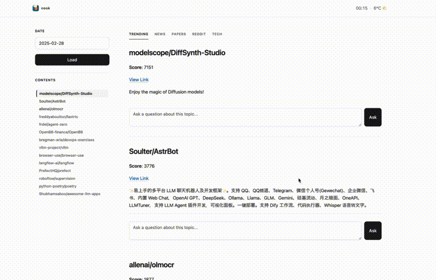
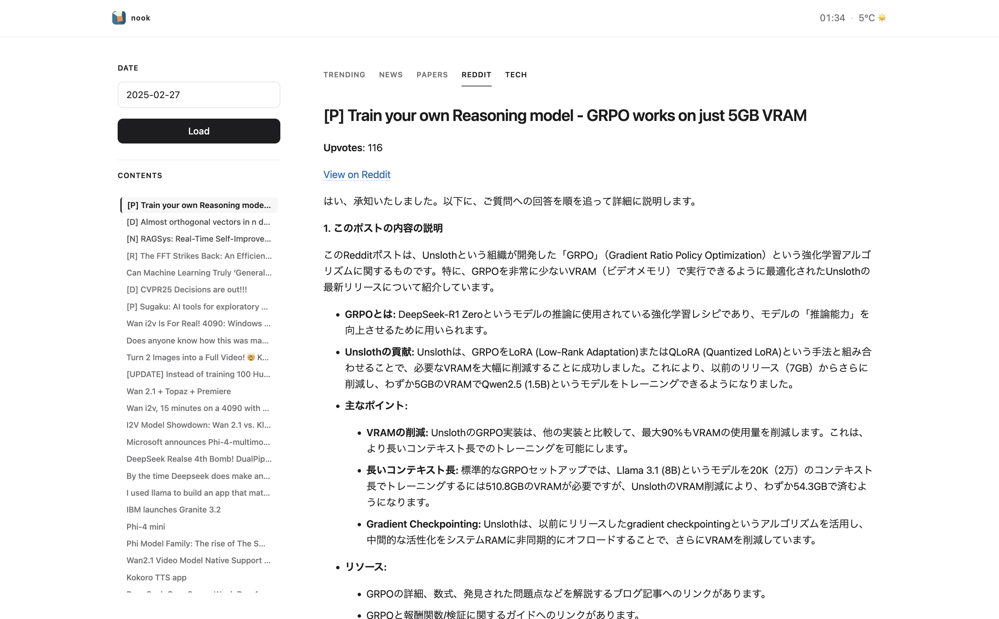
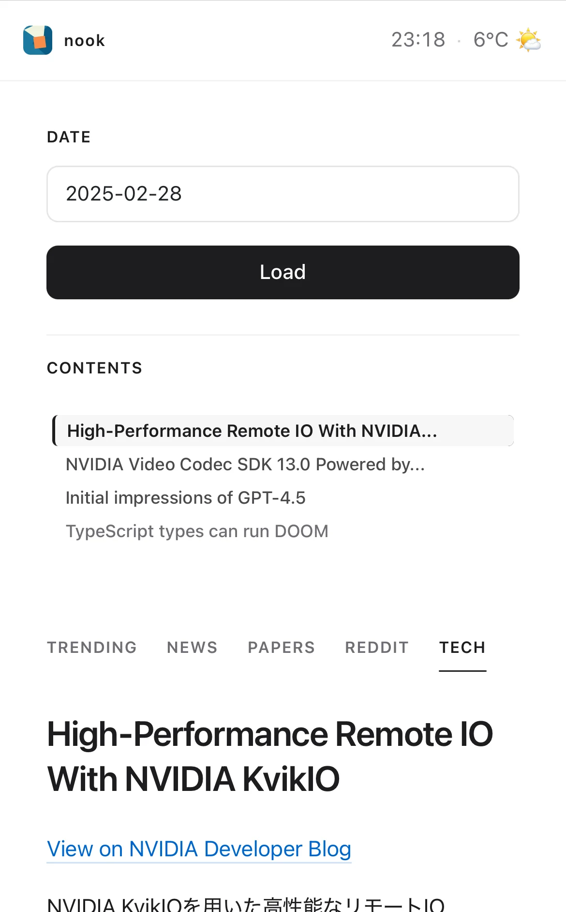
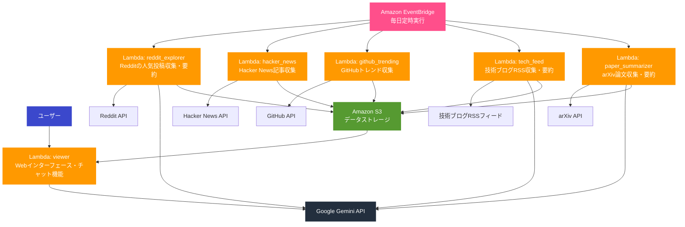
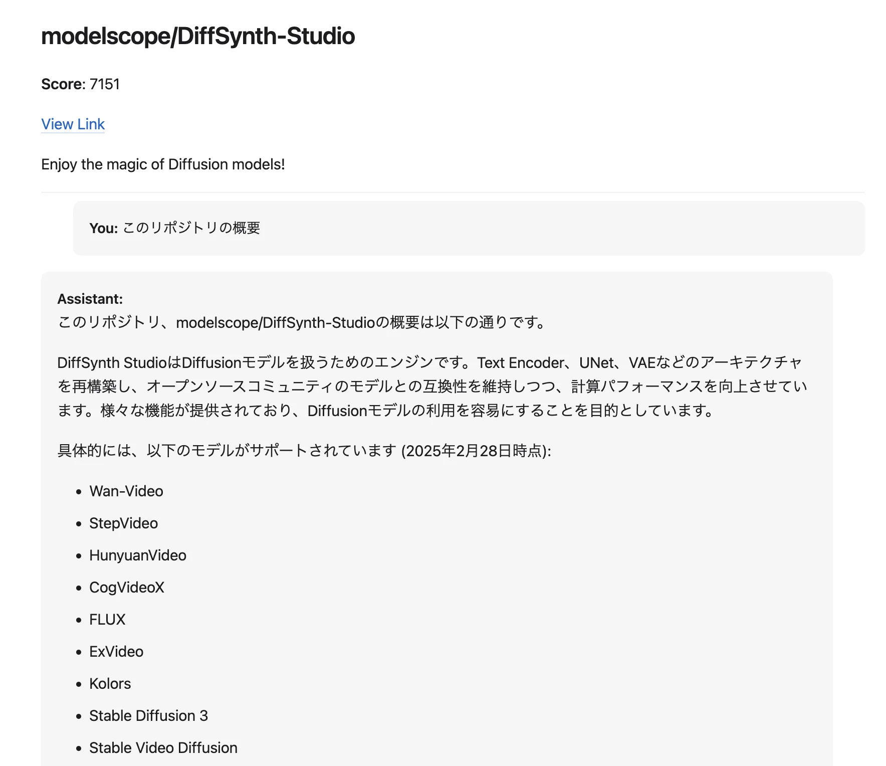

<p align="center">

<br>
</p>
<p align="right"><small><i>Logo generated by Claude 3.7 Sonnet</i></small></p>

<p align="center">
  <b>ブログ記事・Reddit投稿・GitHub動向・論文を毎日自動収集・要約するWebアプリ</b>
  <br>
  <br>
  
</p>

## 🌟 概要

Nookは、テック系の最新情報を自動的に収集し、要約するWebアプリです。

Reddit、Hacker News、GitHub Trending、技術ブログ、学術論文など多様な情報源から毎日自動的にコンテンツを収集し、LLMを使用して日本語で要約します。シンプルなWebインターフェースで閲覧でき、各トピックに対してチャット形式でフォローアップ質問も可能です。

1日平均12円の運用費*で情報収集にかかる時間を大幅に削減します。

## 🎬 外観

### PC

<p align="center">
  
</p>

### モバイル

<p align="center">
  
</p>

## ✨ 特徴

### 🔄 多様な情報源からの自動収集・要約
- **Hacker News**: Hacker Newsから最新のテクノロジーニュースと議論を収集
- **GitHub Trending**: GitHubで各言語ごとの人気リポジトリを取得
- **Reddit**: r/MachineLearningなどのサブレディットから人気投稿を収集して要約
- **RSS**: RSSフィードを監視し、更新があれば取得して要約
- **arXiv論文**: HuggingFaceでキュレーションされた最新の学術論文を自動収集し、HTMLページがあれば論文ごと読んで要約

### 💬 インタラクティブなチャット機能
- **フォローアップ質問**: 要約された内容について、さらに詳しく質問可能（グラウンディングあり）

### 🌐 シンプルなWebインターフェース
- **日付別整理**: 収集した情報を日付ごとに整理して表示
- **レスポンシブデザイン**: モバイルデバイスでも快適に閲覧可能

### 🔧 簡単なデプロイと拡張性
- **AWS CDK**: インフラをコードとして管理し、簡単にデプロイ
- **モジュラー設計**: 新しい情報源の追加が容易
- **カスタマイズ可能**: 設定ファイルの編集で情報源を変更可能

## 🚀 導入方法

### 前提条件

<details>
<summary>必要なツール（クリックして展開）</summary>

- AWS CLI と AWS CDK
  - CDKでのデプロイには強めの権限が必要です。
  - 先に`aws configure`でシークレットなどの認証情報を登録する必要があります。
- Python 3.11 以上
- 以下のAPIキー:
  - Google Gemini API キー
  - Reddit API キー（クライアントID、クライアントシークレット）

</details>

### クイックスタート

1. **リポジトリをクローン**
   ```bash
   git clone https://github.com/discus0434/nook.git
   cd nook
   ```

2. **環境変数の設定**
   `.env` ファイルを作成し、以下の内容を設定
   ```
   GEMINI_API_KEY=your_gemini_api_key
   REDDIT_CLIENT_ID=your_reddit_client_id
   REDDIT_CLIENT_SECRET=your_reddit_client_secret
   REDDIT_USER_AGENT=your_reddit_user_agent
   ```

3. **依存関係のインストール**
   ```bash
   python -m venv .venv
   source .venv/bin/activate  # Windowsの場合: .venv\Scripts\activate
   pip install -r requirements.txt
   pip install -r requirements-dev.txt
   ```

4. **AWS CDKを使ったデプロイ**
   ```bash
   make cdk-deploy  # `cdk deploy`ではない
   ```

5. **アプリにアクセス**
   デプロイ完了後、コンソールに表示される `viewer` 関数のURLからWebインターフェースにアクセスできます。

## 🏗️ アーキテクチャ



## 🛠️ カスタマイズ

### 情報源の追加・変更

各情報源は設定ファイルで管理されており、簡単にカスタマイズできます:

#### Reddit

`nook/lambda/reddit_explorer/subreddits.toml` を編集して、収集するサブレディットを変更できます。

```toml
[[subreddits]]
name = "MachineLearning"

# 新しいサブレディットを追加
[[subreddits]]
name = "LocalLLaMA"
```

#### GitHub Trending

`nook/lambda/github_trending/languages.toml` を編集して、追跡するプログラミング言語を変更できます。

```toml
[[languages]]
name = "python"

# 新しい言語を追加
[[languages]]
name = "javascript"
```

#### 技術ブログ

`nook/lambda/tech_feed/feed.toml` を編集して、RSSフィードを追加/変更できます。

```toml
[[feeds]]
key = "new_blog"
name = "My Favorite Tech Blog"
url = "https://example.com/feed.xml"
```

### UI設定

`nook/lambda/viewer/templates/index.html` を編集して、UIをカスタマイズすることもできます。

## 🔄 使用例

### 日々のテックニュース収集

朝一番にNookにアクセスすれば、昨日1日のうちに発生した以下の情報をだいたい把握できます：

- 🔥 Redditで話題になっている最新の技術トピック
- 📈 GitHub上で人気急上昇中のプロジェクト
- 📰 Hacker Newsの注目記事
- 📚 最新のAI研究論文と主要な発見
- 🌐 更新されたブログ記事

すべて日本語で要約されているため、短時間で効率的に情報をキャッチアップできます。

### フォローアップ質問

記事/リポジトリの詳細について追加で知りたいことがある場合は、チャットインターフェースを使ってフォローアップ質問が可能です。

<p align="center">
  
</p>

### API連携

Nookが収集した情報はS3へ日毎に保存されるので、他のアプリケーションやワークフローと連携することも可能です：

```python
import boto3
import json
from datetime import date

# S3からのデータ取得の例
s3 = boto3.client('s3')
date_str = date.today().strftime("%Y-%m-%d")
response = s3.get_object(
    Bucket="your-nook-bucket",
    Key=f"tech_feed/{date_str}.md"
)
content = response["Body"].read().decode("utf-8")
print(content)
```

## 📄 ライセンス

このプロジェクトはGNU Affero General Public License v3.0の下で公開されています。詳細は [LICENSE](LICENSE) ファイルを参照してください。

## 📬 お問い合わせ

- GitHub Issues: 質問、バグ報告、機能リクエスト
- X: [@IMG_5955](https://x.com/IMG_5955)

<p><small>[*]ただし、使用状況や設定によって費用が変動する可能性があり、実際のコストは保証できません。自己責任での使用をお願いします。</small></p>
